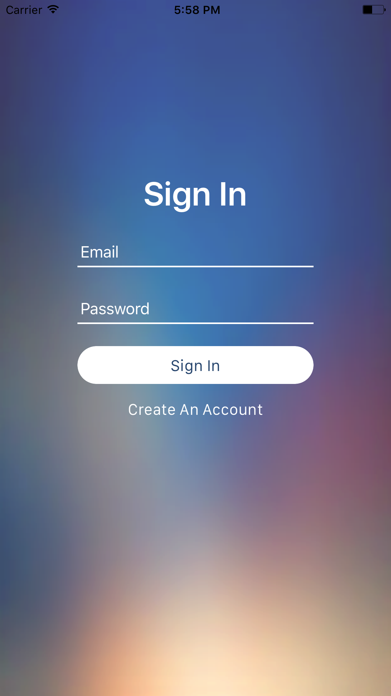
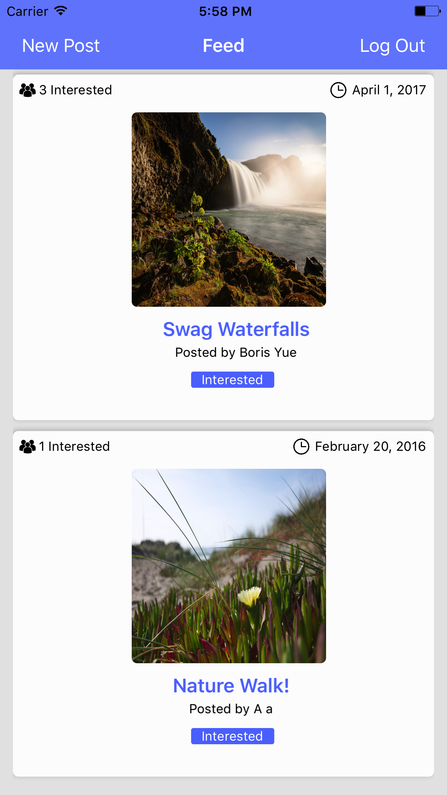
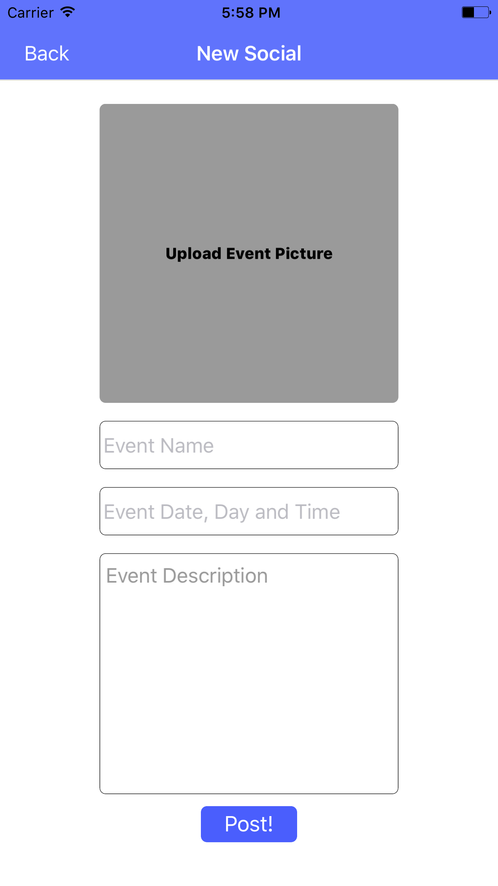
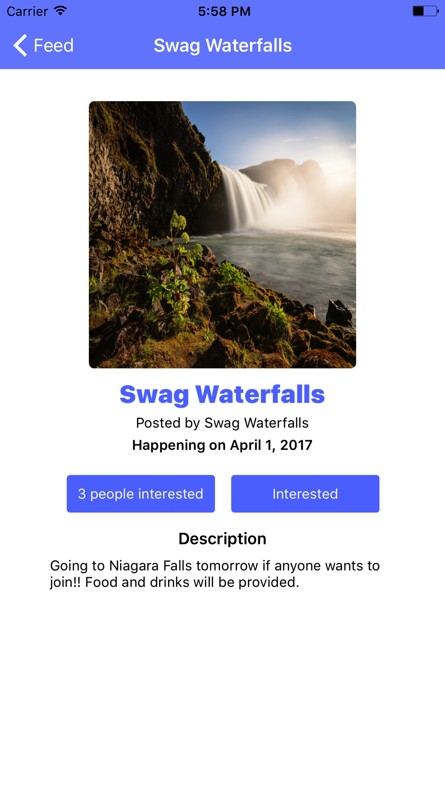
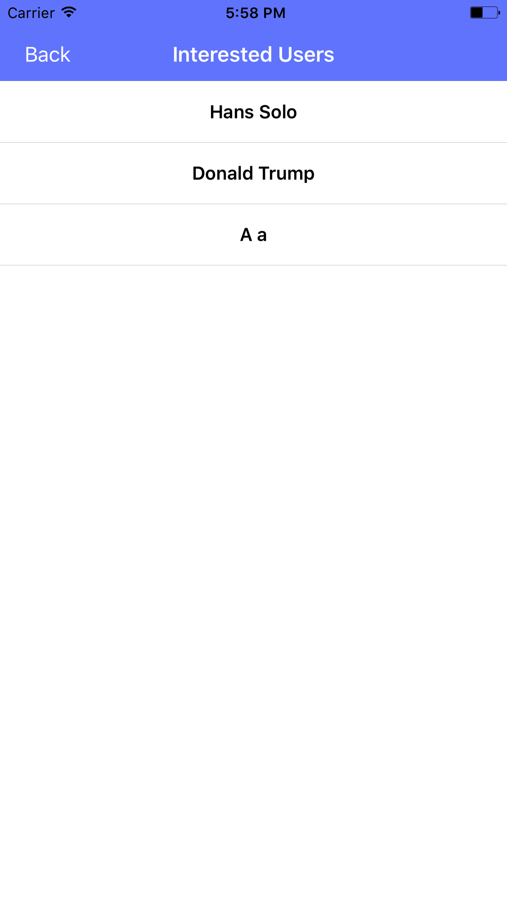

# MDBSocials

Developed a social media application for Mobile Developers of Berkeley. After being authenticated with Firebase, users are directed to a feed where they can post social events that are happening within the organization or view other members' posts. In addition, they can RSVP to eachother's events.

# Key Technologies Used
* Firebase - Authentication, Storage, Database
* Table Views
* Model View Controller structure
* Protocols/delegates

